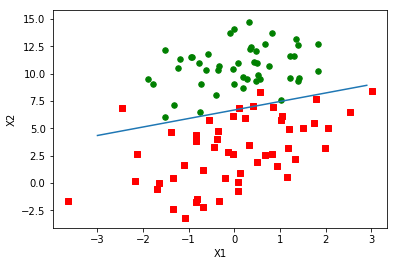

#### 1、加载测试数据


```python
def loadDataSet():
    dataMat=[];labelMat=[]
    fr=open('testSet.txt')
    for line in fr.readlines():
        lineArr=line.strip().split()
        dataMat.append([1.0,float(lineArr[0]),float(lineArr[1])])
        labelMat.append(int(lineArr[2]))
    return dataMat,labelMat
```

#### 2、使用梯度上升找到最佳参数


```python
def sigmoid(inX):
    return 1.0/(1+exp(-inX))
```


```python
# dataMatIn:训练样本矩阵 
# classLabels:类别标签
from numpy import *
def gradAscent(dataMatIn,classLabels):
    dataMatrix=mat(dataMatIn)   #将数组转换为矩阵
    labelMat=mat(classLabels).transpose()
    m,n=shape(dataMatrix)  
    alpha=0.001   #初始化步长
    maxCycles=500 #循环次数
    weights=ones((n,1)) #初始化所求的系数为1的行向量
    for k in range(maxCycles):
        h=sigmoid(dataMatrix*weights)  #获得类别为1的概率
        error=(labelMat-h)
        weights=weights+alpha*dataMatrix.transpose()*error  #梯度上升
    return weights  #返回最佳系数向量
```


```python
dataArr,labelMat=loadDataSet()
weights=gradAscent(dataArr,labelMat)
print(weights)
```

    [[ 4.12414349]
     [ 0.48007329]
     [-0.6168482 ]]


#### 3、画出决策边界


```python
def plotDestFit(wei):
    import matplotlib.pyplot as plt
    weights=wei.getA()
    dataMat,labelMat=loadDataSet()
    dataArr = array(dataMat)
    n = shape(dataArr)[0] 
    xcord1 = []; ycord1 = []
    xcord2 = []; ycord2 = []
    for i in range(n):
        if int(labelMat[i])== 1:
            xcord1.append(dataArr[i,1]); ycord1.append(dataArr[i,2])
        else:
            xcord2.append(dataArr[i,1]); ycord2.append(dataArr[i,2])
    fig = plt.figure()
    ax = fig.add_subplot(111)
    ax.scatter(xcord1, ycord1, s=30, c='red', marker='s')
    ax.scatter(xcord2, ycord2, s=30, c='green')
    x = arange(-3.0, 3.0, 0.1)
    y = (-weights[0]-weights[1]*x)/weights[2]
    ax.plot(x, y)
    plt.xlabel('X1'); plt.ylabel('X2');
    plt.show()

```


```python
plotDestFit(weights)
```





#### 4、随机梯度上升


```python
def stocGradAscent0(dataMatrix,classLabels):
    m,n=shape(dataMatrix)
    alpha=0.01
    weights=ones(n)
    for i in range(m):  #以训练样本的个数为循环次数
        h=sigmoid(sum(dataMatrix[i]*weights)) #值
        error=classLabels[i]-h
        weights=weights+alpha*error*dataMatrix[i]
    return weights
```

#### 5、改进的随机梯度上升算法


```python
def stocGradAscent1(dataMatrix,classLabels,numIter=150):
    m,n=shape(dataMatrix)
    weights=ones(n)
    for j in range(numIter):
        dataIndex=list(range(m))
        for i in range(m):
            alpha=4/(1.0+i+j)+0.0001 #梯度通过迭代次数不断减小
            randIndex=int(random.uniform(0,len(dataIndex))) #随机选取样本来更新回归系数
            h=sigmoid(sum(dataMatrix[randIndex]*weights))
            error=classLabels[randIndex]-h
            weights=weights+alpha*error*dataMatrix[randIndex]
            del(dataIndex[randIndex])
    return weights
```

#### 6、根据sigmoid函数值返回0,1结果


```python
def classifyVector(inX,weights):
    prob=sigmoid(sum(inX*weights))
    if prob>0.5:
        return 1.0
    else:return 0.0
```

#### 7、分类函数


```python
def colicTest():
    frTrain=open('horseColicTraining.txt');frTest=open('horseColicTest.txt')
    trainingSet=[];trainingLabels=[]
    for line in frTrain.readlines():  #训练集
        currLine=line.strip().split('\t')
        lineArr=[]
        for i in range(21):
            lineArr.append(float(currLine[i]))
        trainingSet.append(lineArr)
        trainingLabels.append(float(currLine[21]))
    trainWeights=stocGradAscent1(array(trainingSet),trainingLabels,1000)  #获得最优系数
    errorCount=0;numTestVec=0.0
    for line in frTest.readlines(): #测试集
        numTestVec+=1.0
        currLine=line.strip().split('\t')
        lineArr=[]
        for i in range(21):
            lineArr.append(float(currLine[i]))
        if int(classifyVector(array(lineArr),trainWeights))!=int(currLine[21]):  #计算分类错误的次数
            errorCount+=1
    errorRate=(float(errorCount)/numTestVec)  #错误率
    print("the error rate of this test is: %f" % errorRate)
    return errorRate
```

#### 8、主函数


```python
def multiTest():
    numTests=10;errorSum=0.0
    for k in range(numTests):
        errorSum+=colicTest()
    print ("after %d iterations the average error rate is: %f" % (numTests, errorSum/float(numTests)))
```


```python
multiTest()
```

    the error rate of this test is: 0.343284
    the error rate of this test is: 0.373134
    the error rate of this test is: 0.328358
    the error rate of this test is: 0.298507
    the error rate of this test is: 0.343284
    the error rate of this test is: 0.328358
    the error rate of this test is: 0.283582
    the error rate of this test is: 0.328358
    the error rate of this test is: 0.388060
    the error rate of this test is: 0.373134
    after 10 iterations the average error rate is: 0.338806

